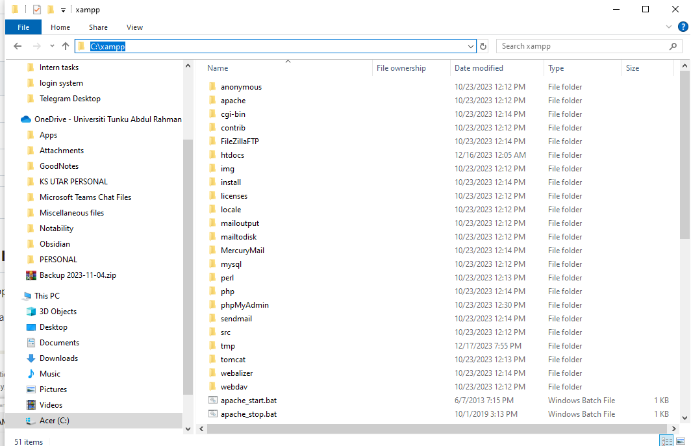
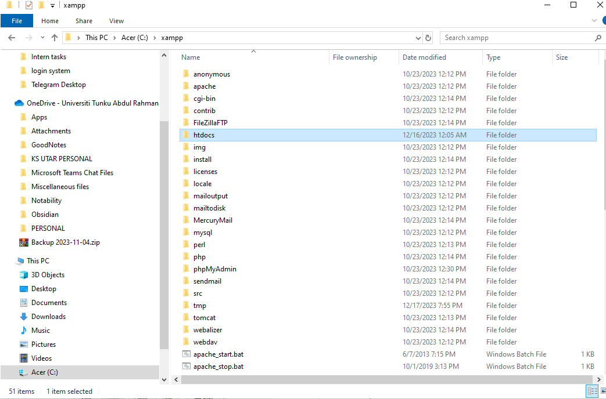
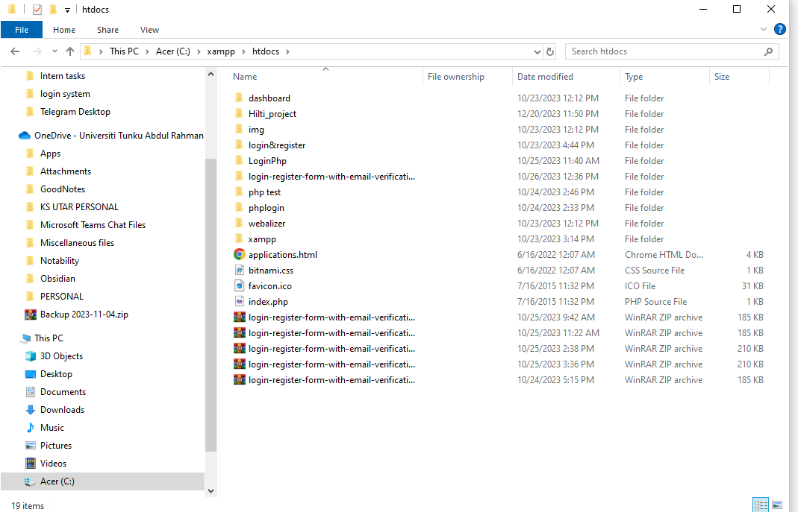
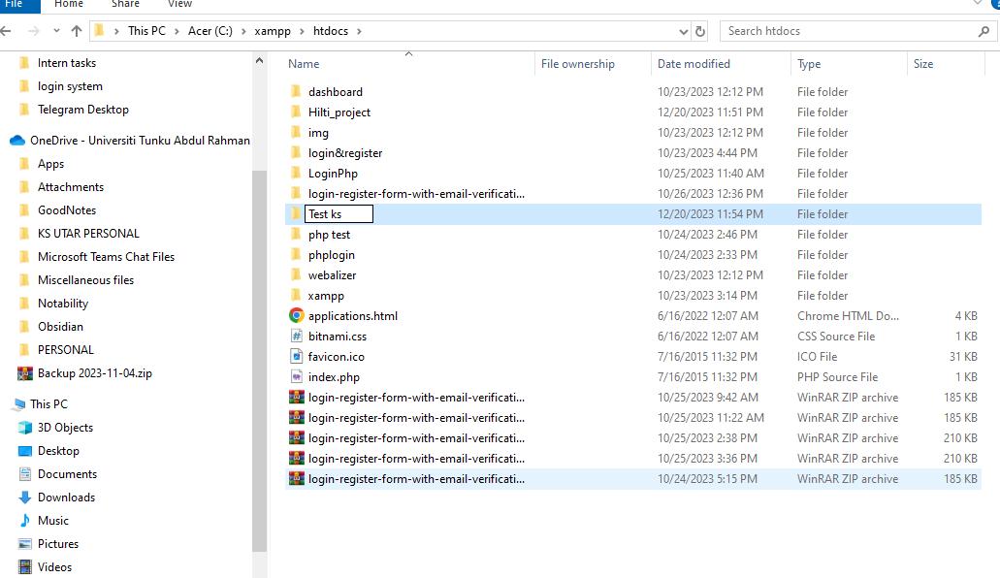
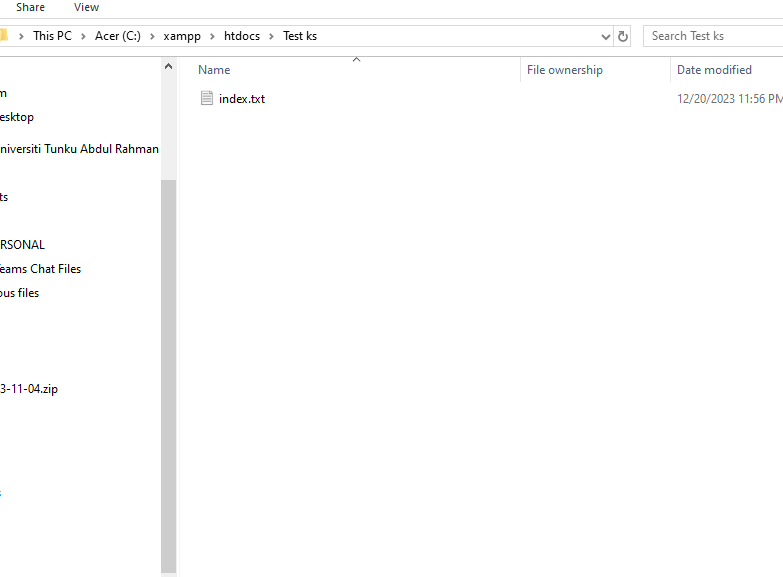
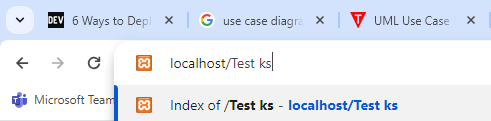
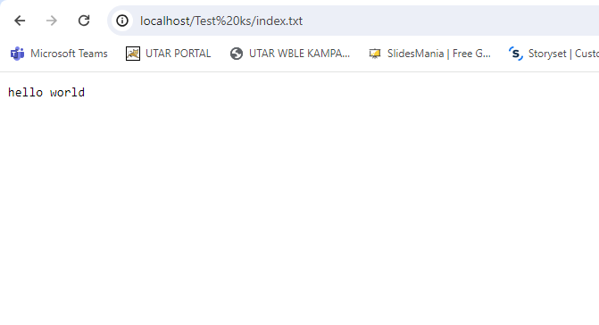
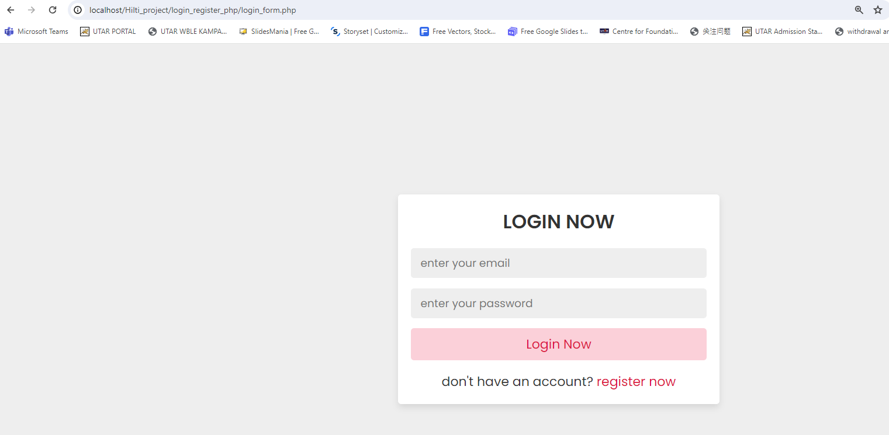

# Competition-Repo for Hilti Project

1) <b>Make sure you have downloaded xampp server from <https://www.apachefriends.org/download.html></b>

* The interface xampp panel would probably look like this :

2) <b>Click start on both Apache and MySql server</b>

3) <b>Can Press on Admin button for MySql, will lead you to database</b>

4) <b>I forgot the steps, but i think by default your xampp will be installed in either one of your main drive folders</b>

5) <b>Ermmm so depending on where you put your xampp folder, find htdocs.</b>
- Example of my path / directory where I installed : 

6) <b>According to my understanding, htdocs is where you should place all your php files</b>

7) <b>now open your web browser, type in the search bar beginning with. "localhost/your_folder_name/file_name"</b>
- Reminder is that, best practice is your folder don't have spaces in between
- Also, remember to start the xampp server

8) <b>The final result would look like this....</b>

9) <b>Depending on your file path and directory, this is how you would see it at last</b>
- Note that, you could directly use php live server extension too!

