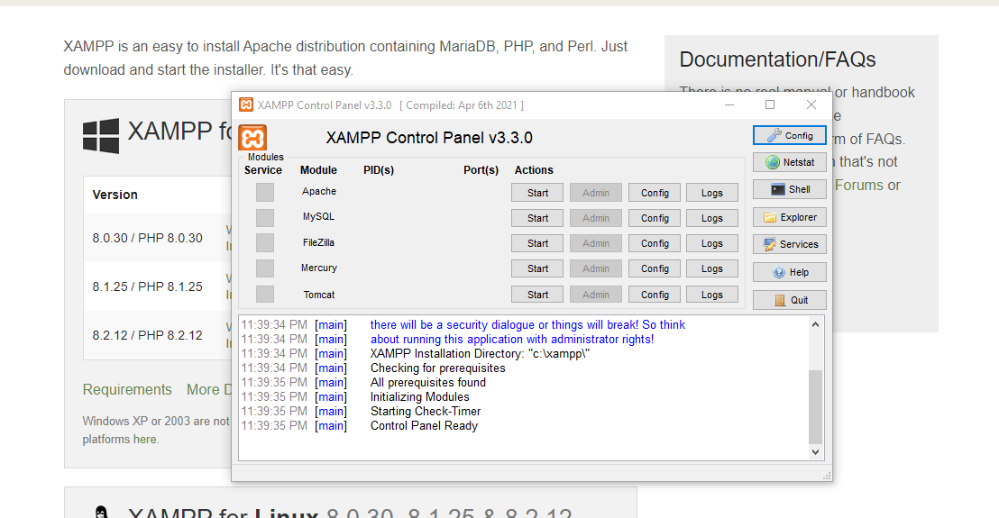

# Competition-Repo for Hilti Project

1) Make sure you have downloaded xampp server from <https://www.apachefriends.org/download.html>

The interface xampp panel would probably look like this :

2) Click start on both Apache and MySql server

3) Can Press on Admin button for MySql, will lead you to database